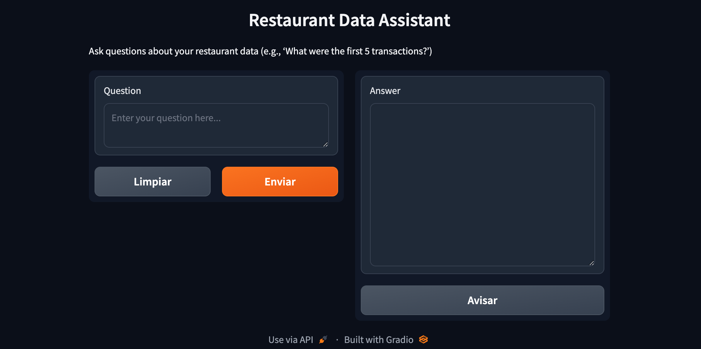

# Restaurant Data Assistant: 
## A Python-based chatbot that analyzes restaurant chain transaction data to provide real-time business insights. This tool processes queries about sales patterns, customer behavior, and operational metrics using a comprehensive transaction database. 

Key Features: 
• Financial Analysis: Sales, revenue, and VAT calculations
• Time-based Analytics: Peak hours and order duration analysis
• Customer Insights: Table occupancy and dining patterns
• Operational Efficiency: Service times and transaction processing
• Menu Performance: Popular dishes and sales trends

Built with Python using pandas for data manipulation and natural language processing for query understanding. Designed to help restaurant managers make data-driven decisions efficiently.

Note: The transaction database file is not included in this repository due to data privacy.
